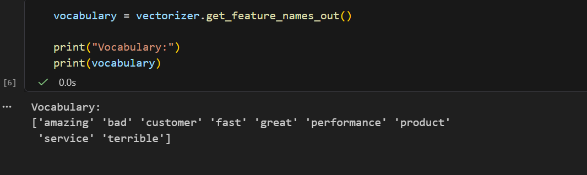
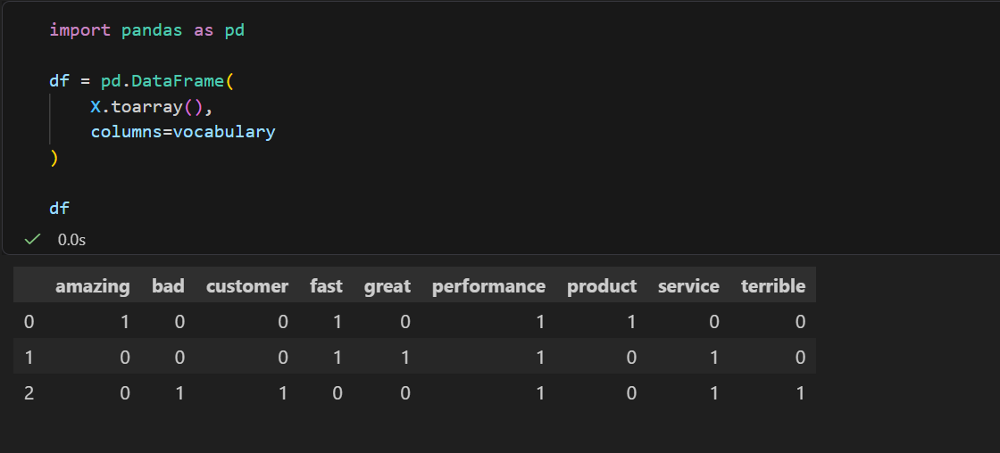
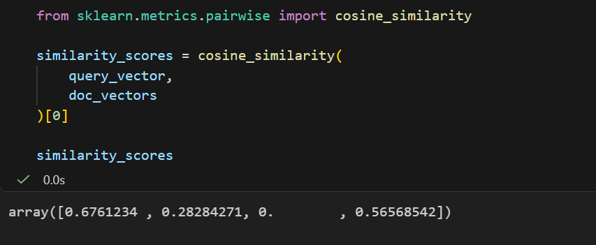
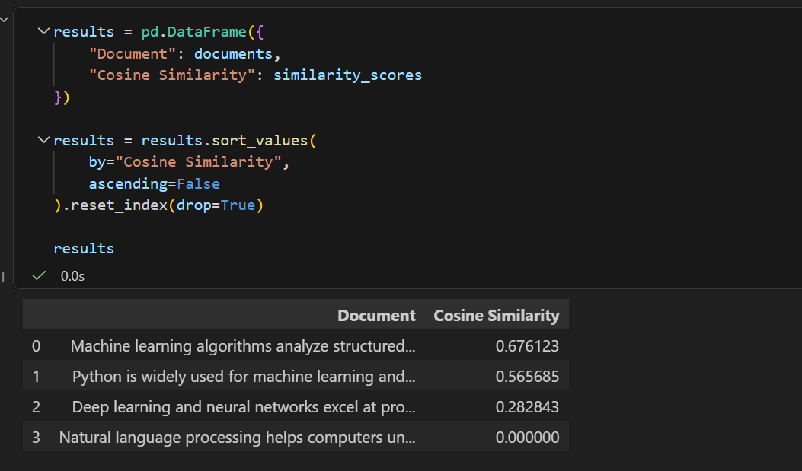

# Assignment of NLP

**Name:** Esha

**Roll Number:** 22/AI/2K24

**Submitted to:** Sir Rajesh

# Lab Submission: Bag of Words & Document Search Engine

## Task 1: Bag of Words Matrix Construction

**Vocabulary extracted from the vectorizer:**

**Resulting Bag of Words matrix:**

## Task 2: Document Search Engine & Relevance Ranking

In this task, a simple search engine is created to rank documents according to their similarity with a given search query.

**Cosine similarity scores between the query and documents:**

**Documents ranked by similarity score:**

## Viva & Reflection Answers

**1. Word Order Invariance**
BoW only tracks word counts, not order, so "Dog bites man" and "Man bites dog" produce identical vectors despite opposite meanings. This hurts sentiment analysis since order-dependent meaning (e.g., negation) is lost.

**2. Sparsity Issue**
With 100,000 unique vocabulary words, each document vector has 100,000 dimensions, but most entries are zero since a document only uses a small subset of words. This creates a highly sparse, low-density matrix, requiring sparse storage formats (e.g., SciPy CSR) instead of dense arrays to stay memory-efficient.

**3. Zero Similarity**
Document 3 has no words in common with the query "machine learning algorithms for data," so the dot product of their vectors is 0, making cosine similarity 0.0000 regardless of topical relevance.